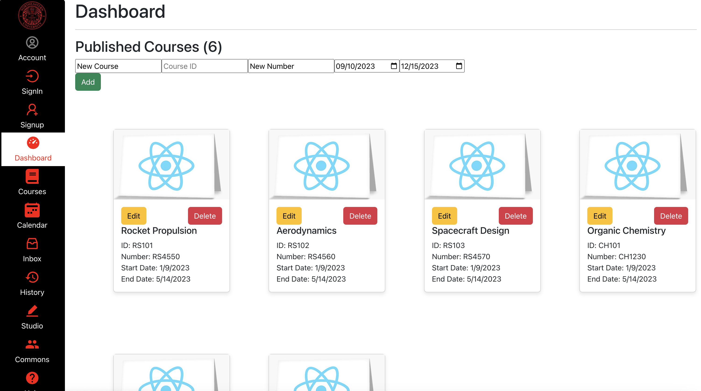
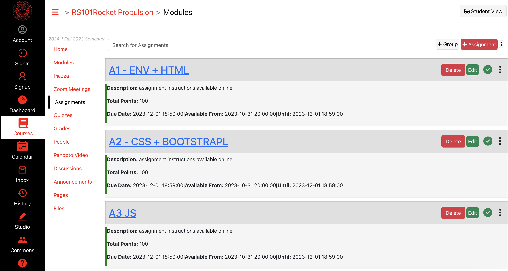
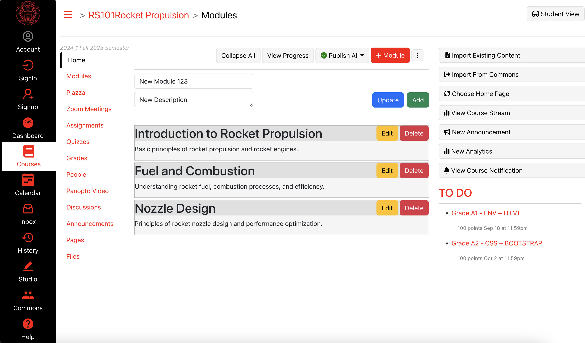
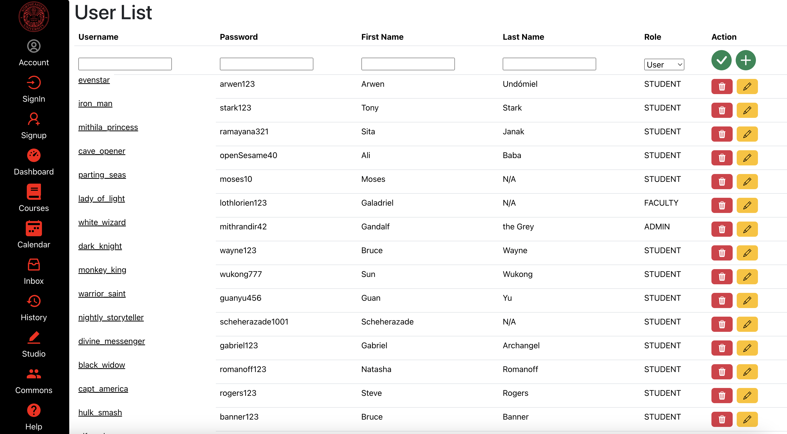

# Kanbas Full-Stack Application
This project is an innovative online education management system, combining the features of a Kanbas-style task management application with the specific needs of educational environments. It's designed to cater to both students and professors, providing distinct interfaces for each user type.

## Frontend Deployed to Netlify
Access the live application here:
https://react-kanbas.netlify.app/#/Kanbas/Dashboard







## Highlights
- Professor Interface:
Ability to post lectures, course materials, grades, and assignments.
Options to manage and update student profiles.
Interactive dashboard to overview course progress and student performance.

- Student Interface:
Access to lectures, course materials, and grades.
Ability to submit assignments and track deadlines.
Personalized dashboard to view course tasks and schedules.

- Task Management (Kanbas-style):
Both students and professors can create, update, and organize tasks related to courses.
Visual task boards for tracking the progress of lectures, assignments, and grades.

- Managed local component state in React using state and effect hooks for isolated state management.

- Integrated Redux for managing global application state, ensuring consistency and predictability across the application.

- Established a Node.js backend that interfaces with MongoDB for persistent CRUD operations.

- Deployed the application on Netlify, demonstrating the ability to manage and deploy web applications in a live environment.

## Features

- **React.js**: Powers the dynamic front-end user interface.
- **Redux**: Manages global state for a consistent user experience.
- **Node.js**: Facilitates a robust backend server.
- **MongoDB**: Ensures data persistence and enables CRUD operations.
- **Netlify**: Hosts the application, enabling real-world accessibility.
- **Bootstrap**: Provides a responsive layout and design.
- **FontAwesome**: Enhances the UI with attractive icons.

## Local Development Setup

Before setting up the project locally, ensure Node.js, npm (or yarn), and MongoDB are installed on your machine.

## Deployment
The project is deployed on Netlify with continuous deployment from the main branch. To deploy your own version, follow these steps:

Build your React application:
```sh
npm run build
```
Connect your GitHub repository to Netlify.

Configure your build settings and deploy.

# Getting Started with Create React App

This project was bootstrapped with [Create React App](https://github.com/facebook/create-react-app).

## Available Scripts

In the project directory, you can run:

### `npm start`

Runs the app in the development mode.\
Open [http://localhost:3000](http://localhost:3000) to view it in your browser.

The page will reload when you make changes.\
You may also see any lint errors in the console.

### `npm test`

Launches the test runner in the interactive watch mode.\
See the section about [running tests](https://facebook.github.io/create-react-app/docs/running-tests) for more information.

### `npm run build`

Builds the app for production to the `build` folder.\
It correctly bundles React in production mode and optimizes the build for the best performance.

The build is minified and the filenames include the hashes.\
Your app is ready to be deployed!

See the section about [deployment](https://facebook.github.io/create-react-app/docs/deployment) for more information.

### `npm run eject`

**Note: this is a one-way operation. Once you `eject`, you can't go back!**

If you aren't satisfied with the build tool and configuration choices, you can `eject` at any time. This command will remove the single build dependency from your project.

Instead, it will copy all the configuration files and the transitive dependencies (webpack, Babel, ESLint, etc) right into your project so you have full control over them. All of the commands except `eject` will still work, but they will point to the copied scripts so you can tweak them. At this point you're on your own.

You don't have to ever use `eject`. The curated feature set is suitable for small and middle deployments, and you shouldn't feel obligated to use this feature. However we understand that this tool wouldn't be useful if you couldn't customize it when you are ready for it.

## Learn More

You can learn more in the [Create React App documentation](https://facebook.github.io/create-react-app/docs/getting-started).

To learn React, check out the [React documentation](https://reactjs.org/).

### Code Splitting

This section has moved here: [https://facebook.github.io/create-react-app/docs/code-splitting](https://facebook.github.io/create-react-app/docs/code-splitting)

### Analyzing the Bundle Size

This section has moved here: [https://facebook.github.io/create-react-app/docs/analyzing-the-bundle-size](https://facebook.github.io/create-react-app/docs/analyzing-the-bundle-size)

### Making a Progressive Web App

This section has moved here: [https://facebook.github.io/create-react-app/docs/making-a-progressive-web-app](https://facebook.github.io/create-react-app/docs/making-a-progressive-web-app)

### Advanced Configuration

This section has moved here: [https://facebook.github.io/create-react-app/docs/advanced-configuration](https://facebook.github.io/create-react-app/docs/advanced-configuration)

### Deployment

This section has moved here: [https://facebook.github.io/create-react-app/docs/deployment](https://facebook.github.io/create-react-app/docs/deployment)

### `npm run build` fails to minify

This section has moved here: [https://facebook.github.io/create-react-app/docs/troubleshooting#npm-run-build-fails-to-minify](https://facebook.github.io/create-react-app/docs/troubleshooting#npm-run-build-fails-to-minify)
